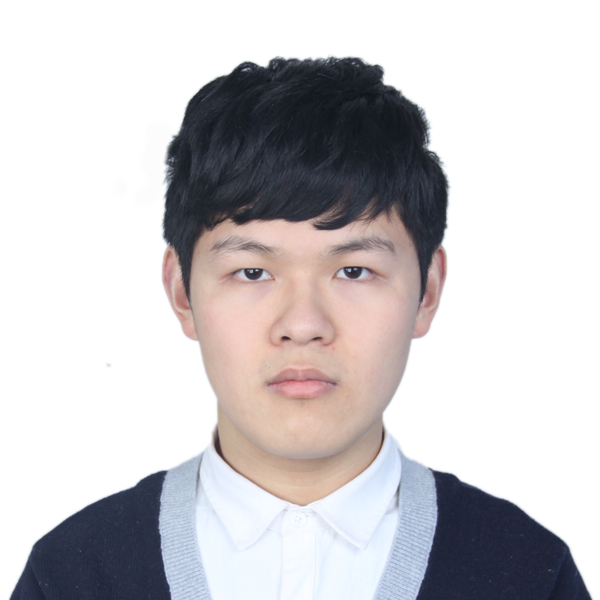

---
hide:
  - navigation
  - toc

# glightbox.auto_caption: true

---

# About me

{width="200", align=right}
## Yiyang Lu
<!-- {width="200px",align=left }  -->
<!--  -->

[Email :fontawesome-solid-paper-plane:](mailto:ylu21@wm.edu "ylu21 AT wm.edu"){ .md-button } [CV :material-more:](assets/paper/cv.pdf){ .md-button }  

<!-- :material-file-account: [CV](assets/paper/cv.pdf) -->

*:material-school: Ph.D. Candidate in Computer Science, [William & Mary](https://www.wm.edu/as/computerscience/).*

**Co-Advisors**: [Prof. Jie Ren](https://jren73.github.io/), [Prof. Evgenia Smirni](https://www.cs.wm.edu/~esmirni/)

**Research Interest**: Agentic AI, Resilience, Anomaly Detection, Safety-Critical Systems, Time Series Analytics, HPC

<!-- [:material-email: Email](mailto:ylu21@wm.edu "ylu21 AT wm.edu"){ .md-button } [:simple-googlescholar: Google Scholar](https://scholar.google.com/citations?hl=en&user=tmrnmuUAAAAJ){ .md-button }   -->
<!-- [:material-more: Resume](https://scholar.google.com/citations?hl=en&user=tmrnmuUAAAAJ){ .md-button } -->

## Education
- William & Mary, **Ph.D. in Computer Science** `2021 - Present`
- University of Electronic Science and Technology of China, **B.S. in Software Engineering** `2016 - 2020`

## Publications

!!! note ""

    __Introspective and Interactive Visual Grounding for Visualization Agents__

    __Yiyang Lu__, Woong Shin, Ahmad Maroof Karimi, Feiyi Wang, Jie Ren, Evgenia Smirni.

    ACM SIGMETRICS 2026 Student Poster Session, to be presented. `SIGMETRICS 2026`

!!! note ""

    __ML-Based GPU Error Prediction in Production HPC: Challenges and Trade-offs__ (SUBMITTED)

    __Yiyang Lu__ , Woong Shin, Ahmad Maroof Karimi, Feiyi Wang, Evgenia Smirni, Jie Ren.

!!! note ""

    __Mantis: Decoding HPC Telemetry Data for Robust System Prediction__

    __Yiyang Lu__ , Jie Ren, Evgenia Smirni. 

    Proceedings of the 40th ACM International Conference on Supercomputing, to appear. `ICS 2026`

!!! note ""

    __On Predicting Vulnerability Severity Using In-Context Learning: An Industrial Case Study__

    Daniel Rodriguez-Cardenas, David N. Palacio, Anna Schmedding, __Yiyang Lu__, Bill Hudson, Chris Gourley, Michael Roytman, Chris Shenefiel, Evgenia Smirni, Denys Poshyvanyk.

    Journal of Software: Evolution and Process, to appear.

!!! note ""

    __Strategic Resilience Evaluation of Neural Networks within Autonomous Vehicle Software__ [:fontawesome-solid-file-arrow-down:](assets/paper/2024_safecomp.pdf)

    Anna Schmedding, Philip Schowitz, Xugui Zhou, __Yiyang Lu__, Lishan Yang, Homa Alemzadeh and Evgenia Smirni. 

    SAFECOMP2024: 43rd International Conference on Computer Safety, Reliability and Security.  `SAFECOMP 2024 `

!!! note ""

    __Investigating Anomalies in Compute Clusters: An Unsupervised Learning Approach__ [:fontawesome-solid-file-arrow-down:](assets/paper/2023_SC_poster.pdf)

    __Yiyang Lu__ , Jie Ren, Yasir Alanazi, Ahmed Mohammed, Diana McSpadden, Laura Hild, Mark Jones, Wesley Moore, Malachi Schram, Bryan Hess, Evgenia Smirni. 

    SC '23 Research Posters: Proceedings of the International Conference on High Performance Computing, Networking, Storage and Analysis, November 2023.  `SC 23`

!!! note ""

    __Measuring children’s eating behavior with a wearable device__ [:fontawesome-solid-file-arrow-down:](assets/paper/2020_ICHI.pdf)

    Shengjie Bi, __Yiyang Lu__ , Nicole Tobias, Ella Ryan, Travis Masterson, Sougata Sen, Ryan Halter, Jacob Sorber, Diane Gilbert-Diamond, and David Kotz. 

    Proceedings of the IEEE International Conference on Healthcare Informatics, December 2020.  `ICHI 2020`

## Datasets

!!! note ""

    __Dataset for Investigating Anomalies in Compute Clusters__ [:fontawesome-solid-file-arrow-down:](https://zenodo.org/records/10058230)

    Diana McSpadden, Yasir Alanazi, Bryan Hess, Laura Hild, Mark Jones, __Yiyang Lu__, Ahmed Mohammed, Wesley Moore, Jie Ren, Malachi Schram, Evgenia Smirni.

## Research Experience

- Oak Ridge National Laboratory (ORNL): Graduate Research Intern  `June 2025 - Aug 2025`
- William & Mary: Research Assistant  `June 2022 - Present`
    - Data Science Agent
        - Built visualization agents with direct plot introspection and interaction to alleviate VLM data hallucination.
        - Developed iPlotBench, a benchmarking suite for evaluating agentic visualization capabilities.
        - Developed Deep Plot for iterative data exploration and automated insights generation.
    - HPC telemetry analysis
        - Analyzed a large amount of real-world production telemetry data from OLCF, JLab clusters.
        - Proposed a predictive framework that adapts to diverse tasks, including anomaly detection and workload prediction.
        - Developed a method to reveal telemetry relationships, offering a holistic view of system behavior.
    - Resilience Evaluation of Autonomous Vehicle Models
        - Performed strategic resilience evaluation on an L4 autonomous driving system.
        - Examined the effectiveness of mitigation on critical faults in autonomous vehicles.

- [Li Xiaojian's Group](http://bcbdi.siat.ac.cn/index.php/member/showMember/nid/13.shtml) in SIAT CAS: Research assistant for "Brain-Computer Interface" `2020`
- [David Kotz's Group](https://www.cs.dartmouth.edu/~dfk/) in Dartmouth College: Research assistant for ["Wearable Technology"](https://auracle-project.org/) `2019`

## Industry Experience

- ByteDance: Research & Development Intern for "Network Traffic Analysis" `2021`

## Awards
- William&Mary Summer Graduate Research Fellowship (2021)
- UESTC Outstanding Student Scholarship (2016-2017, 2017-2018)

## Professional Service
- HPDC'26: International Symposium on High-Performance Parallel and Distributed Computing 2026 (subreviewer)
- Sigmetrics'26: Special Interest Group on Measurement and Evaluation 2026 (subreviewer)
- Sigmetrics'25: Special Interest Group on Measurement and Evaluation 2025 (subreviewer)
- Sigmetrics'24: Special Interest Group on Measurement and Evaluation 2024 (subreviewer)
- MSN 2022: The 18th International Conference on Mobility, Sensing and Networking (subreviewer)

## Teaching Assistant
- CSCI241 Data Structures (Fall 2022)
- CSCI534 Nework Systems and Design (Spring 2022)
- CSCI243 Discrete Structures of CSCI (Fall 2021)

## Tools
 - Programming Languages: Python, Embedded C, Java, Go
 - Data analysis: PyTorch, NumPy, Pandas, Pyspark, Tsfresh, Librosa, Optuna, Matplotlib, Plotly, PyG, Networkx
 - Simulators: Carla, Apollo, Autoware
 - Databases: Spark, Hive, Elasticsearch, ClickHouse
