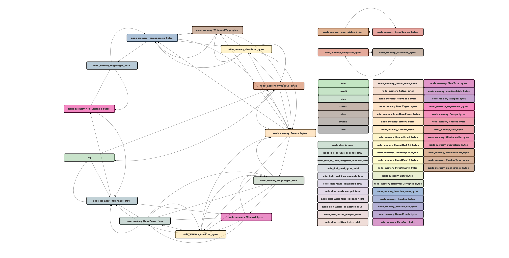

---
hide:
  - navigation
  - toc

# glightbox.auto_caption: true

---
# Project

{width="300", align=right}
## HPC telemetry analysis

As compute clusters continue to grow in scale and complexity, the analysis of HPC telemetry becomes increasingly challenging. This project aims to leverage novel learning methods to understand system dynamics and the relationships between telemetry data.

{width="300", align=right}
## Strategic Resilience Evaluation of Neural Networks within Autonomous Vehicle Software

Self-driving technology has become increasingly advanced over the past decade due to the rapid development of deep neural networks (DNNs). We evaluate the effects of transient faults in DNNs and present a methodology to efficiently locate critical fault sites in  DNNs deployed within two cases of autonomous vehicle (AV) agents: Learning by Cheating (LBC) and OpenPilot. We locate the DNN fault sites using a modified Taylor criterion and strategically inject faults that can affect the functioning of AVs in different road and weather scenarios. Our fault injection methodology identifies corner cases of DNN vulnerabilities that can cause hazards and accidents and therefore dramatically affect AV safety. Additionally, we evaluate mitigation mechanisms of such vulnerabilities for both AV agents and discuss the insights of this study.

